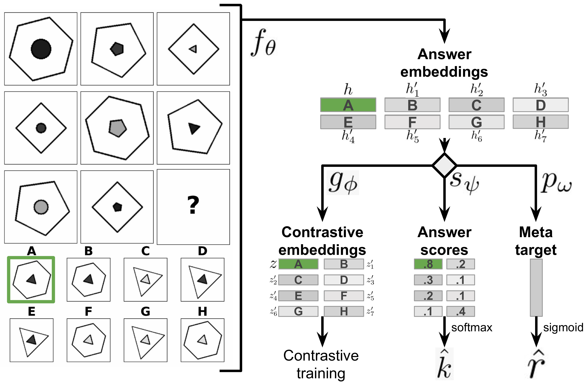

# Multi-Label Contrastive Learning for Abstract Visual Reasoning
PyTorch implementation of Multi-Label Contrastive Learning (MLCL) for solving Raven's Progressive matrices (RPMs) [1].
The approach casts the problem of solving RPMs into a multi-label classification framework, where each RPM is viewed as
a multi-label data point, with labels determined by the set of abstract rules underlying the RPM. MLCL combines a
generalisation of the Noise Contrastive Estimation algorithm to the case of multi-label samples, a sparse rule encoding
scheme for RPMs, and several data augmentation methods crafted specifically for Raven's matrices.

## Datasets
The datasets can be obtained from the corresponding GitHub repositories:
- [PGM](https://github.com/deepmind/abstract-reasoning-matrices),
- [I-RAVEN](https://github.com/husheng12345/SRAN).

## Running experiments
The recommended way to run the experiments is to use [docker](https://www.docker.com/) or [enroot](https://github.com/NVIDIA/enroot).
The docker image can be built by running `./scripts/build_docker_image.sh`.
After building the image, it can be converted to an enroot image with `./scripts/create_enroot_image.sh`.
Next, the experiments can be run for instance as a [Slurm](https://slurm.schedmd.com/overview.html) job with the help of `./scripts/submit_{iraven,pgm}.sbatch` scripts.

## Bibliography
[1] Małkiński, Mikołaj, and Jacek Mańdziuk. "Multi-label contrastive learning for abstract visual reasoning." IEEE Transactions on Neural Networks and Learning Systems (2022).

## Citations
```bibtex
@article{malkinski2022multi,
  title={Multi-label contrastive learning for abstract visual reasoning},
  author={Ma{\l}ki{\'n}ski, Miko{\l}aj and Ma{\'n}dziuk, Jacek},
  journal={IEEE Transactions on Neural Networks and Learning Systems},
  year={2022},
  publisher={IEEE}
}
```
